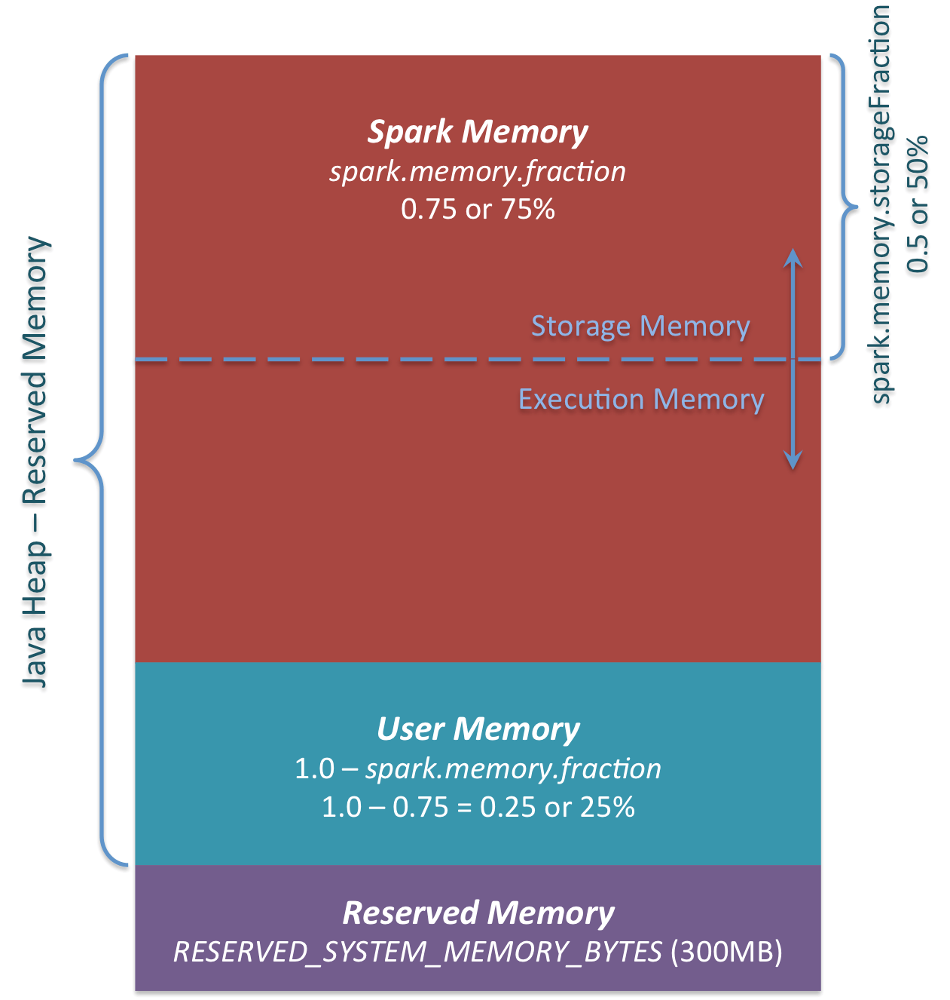

# Spark Memory Manager :

Spark Memory Manager is responsible for managing the execution and storage memory. We have one memory manager for each 
JVM. There are two approaches of managing the memory across execution and storage. Either we can fix size for both of 
them or be a little flexible and dynamically change their size depending on the spark application.

Spark used the first approach to start with and wrote `StaticMemoryManager` which fixes the size for execution and storage.

* **Static Memory Manager** : Spark used this memory manager by default until spark 1.6. Static Memory Manager allocates
fixed amount of memory to execution and storage. Although spark provides configurations to change these sizes before application
starts running. The major drawback here was that even if an application don't need any storage memory, it can't use the 
fraction of reserved storage memory and vice versa. To use this static memory manager after spark 1.6 we need to switch 
legacy configuration.

* **Unified Memory Manager** : The major drawback of static memory manager was that it allocates fixed size to execution
and storage. Unified memory manager tries to solve this problem by dynamically allocating memory to execution and storage.
It maintains a soft boundary which keeps changing depending on the spark application memory requests. Spark proposed this
solution in spark 1.6 and since then Unified Memory Manager is used as default memory manager. 

 

We have three regions of memory available to us as we discussed earlier. Apart from reserved memory we have
spark memory and user memory. We can configure the spark memory using `spark.memory.fraction`. By default it is set to
0.6. Initially default was 0.75 but later it changed to 0.6 to improve the performance of spark application.

* Off-Heap memory is only divided into 2 regions. One for execution and other for storage. Their size is decided by
`spark.memory.storageFraction`.

By default, we set a soft boundary at 50%(using configuration spark.memory.storagefraction) i.e. both storage and execution
can take 50% each of total spark memory.  
Lets understand this soft boundary by two scenarios:

* Our application is storage intensive and it caches a lot of data. And lets assume already it has used 70% of total 
spark memory. Now what will happen if a request for execution memory comes ? Spark will first check whether it can expand
the boundary of execution memory which it certainly can as soft boundary is set to 50% and our storage is using more than
its fair share of memory. So some of the cached data will be evicted to disk and required amount to space will be provided
for execution.

* Our application is execution intensive and it uses a lot execution memory and lets assume that it has already used 
70% of total memory. So now what will happen if a new request for storage memory comes? Well first spark will check 
whether it has any amount of storage memory left, it its available then it will use that memory. What if there is no 
storage memory left as well ? Now what spark will do ? As we remember the soft boundary is set to 50 % and execution is 
using more than its fair share of memory. So some of execution data should be evicted to disk as we have seen in above case.
Spark handle it other way though, it evicts some of the storage data to disk and then deals with the current request for
storage memory. The main argument behind this approach is that if we evict some of the execution data to disk then its atmost 
certain that it will be brought back into memory to complete the execution of application while same cant be said for the
storage data. It may or may not be brought back into the memory. Also while evicting the execution data is pretty 
complex process.

So this means that execution will always acquire any amount of memory ? What with application which requires to have a 
lots of cache and also needs lots of execution memory as well, such as ML applications. Well here 'spark.memory.storagefraction' 
comes into play. Execution area can't be expanded beyond this boundary if our application has already acquired that much
storage area. 

* Until spark 2.4 both static memory manager and unified memory manager were there for users. From spark 3.0, only unified
memory manager is available for users.

Until now we have seen how memory is arbitrated between execution and storage. But this is not the only arbitration that spark
has to do while managing memory for a spark application.

a.) How to manage memory across different tasks of an application?
b.) How to manage memory across different operators of a task?

We will discuss all this in next few chapters.

We must remember this always, Memory manager never allocates physical memory. It only tells how much memory to grant
in case of execution memory request and whether to grant requested memory or not in case of storage memory request.

Who exactly allocates the physical memory then? And who make these memory requests?
We will answer this in next chapter [MemoryAllocator](MemoryManager.md).
